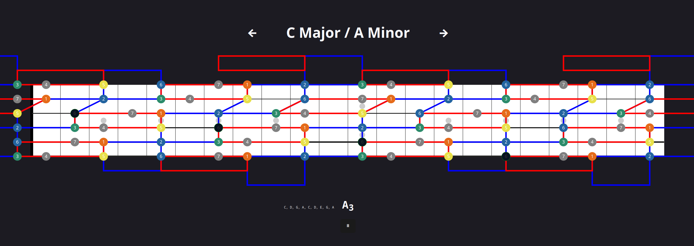

# fretboard
Interface for visualizing musical notes and learning scale patterns on a virtual guitar fretboard. Musical notes being played on a real guitar are rendered on the virtual fretboard by using the webassembly pitch detection module `wasm-audio`.

The repeatable red and blue geometric shapes are based of the Fret Science [video](https://www.youtube.com/watch?v=wzWE0dpxnmY), which explains how the shapes can be used to find the major and minor pentatonic scale anywhere on the fretboard and how they relate to different scale modes.




## Installation & Usage
build the wasm pkg
```
wasm-pack build wasm-audio --target web
```
install and serve the application on localhost
```
npm install
npm run dev
```